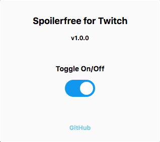
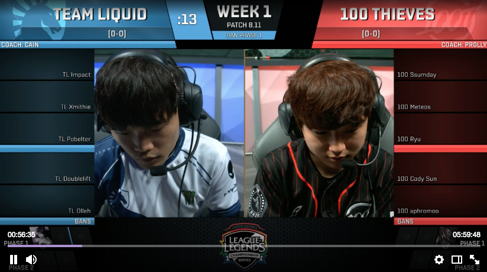
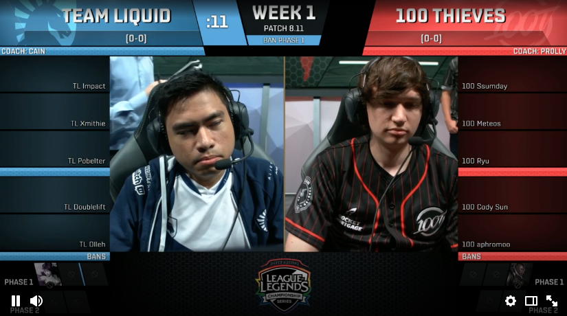

# Spoilerfree for Twitch
Hides Twitch.tv progress and video length
=======

An open-source extension (currently only for Google Chrome) that hides Twitch.tv progress and video length.

Intented for those who wants to watch e-sport VODs on Twitch.tv, but without getting spoiled.

## Screenshots

  

-

  <text>With extension off<text>
  

-

  <text>With extension on<text>
  

## Installation

1. Open the Extension Management page by navigating to chrome://extensions. The Extension Management page can also be opened by clicking on the Chrome menu, hovering over More Tools then selecting Extensions.

2. Enable Developer Mode by clicking the toggle switch next to Developer mode.

3. Click the LOAD UNPACKED button and select the 'chrome' directory.

Alternatively, you can install it through Chrome web store

 https://chrome.google.com/webstore/detail/spoilerfree-for-twitch/bdmofbafkffofipoldeknpidhbjhnpck

## Bugs / Feature Requests

If you find any bugs or have a feature request, please create an issue in [GitHub](https://github.com/ndh-dominic/Spoilerfree-for-Twitch).

## Contributing

To get started with developing extensions for Chrome, it is highly recommended that you start by reading Google's get started guide.

https://developer.chrome.com/extensions/getstarted

#### To contribute to this project

1. Fork (<https://github.com/ndh-dominic/Spoilerfree-for-Twitch>)

2. Create your feature branch (`git checkout -b feature/fooBar`)

3. Commit your changes (`git commit -am 'Add some fooBar'`)

4. Push to the branch (`git push origin feature/fooBar`)

5. Create a new Pull Request

## License

Distributed under the MIT license. See ``LICENSE`` for more information.
